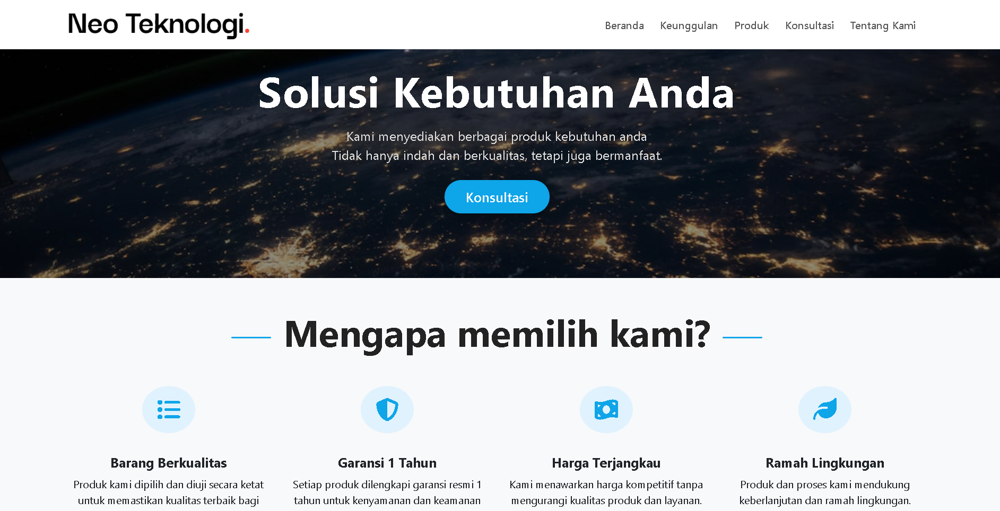

# Landing Page Neo Teknologi

Landing page responsif untuk Neo Teknologi, menampilkan produk, keunggulan, konsultasi, dan profil perusahaan. Dibuat dengan Bootstrap 5 dan custom CSS, serta warna yang disesuaikan dengan branding logo.

## Preview




## Fitur
- Responsive design (mobile & desktop)
- Section produk, keunggulan, konsultasi, dan tentang kami
- Warna sesuai branding Neo Teknologi (pink pastel & maroon)
- Navigasi smooth dan modern
- Siap untuk di-deploy ke hosting statis

## Cara Menjalankan
1. Clone repository ini:
   ```
   git clone https://github.com/Wanzzy1/Landing-Page-NeoTeknologi.git
   ```
2. Buka file `index.html` di browser.

## Struktur Folder
```
assets/img/      # Gambar dan logo
index.html       # Halaman utama
```

## Tools & Credit
- [Bootstrap 5](https://getbootstrap.com/)
- [Font Awesome](https://fontawesome.com/)
- Unsplash (untuk gambar produk)

---

> Landing page ini dibuat untuk kebutuhan portofolio dan latihan web development.
